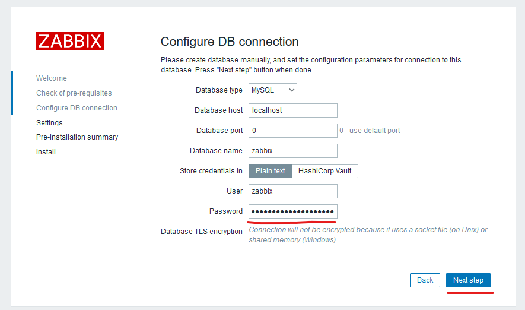
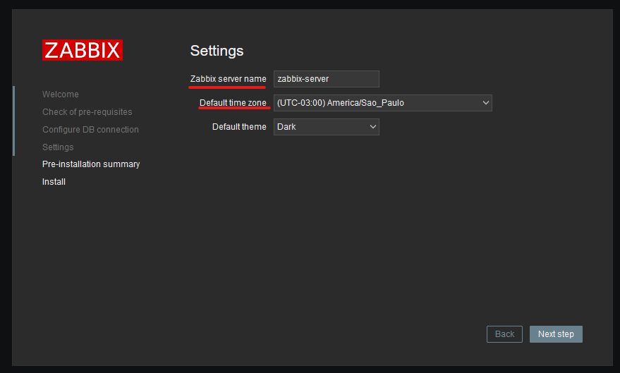
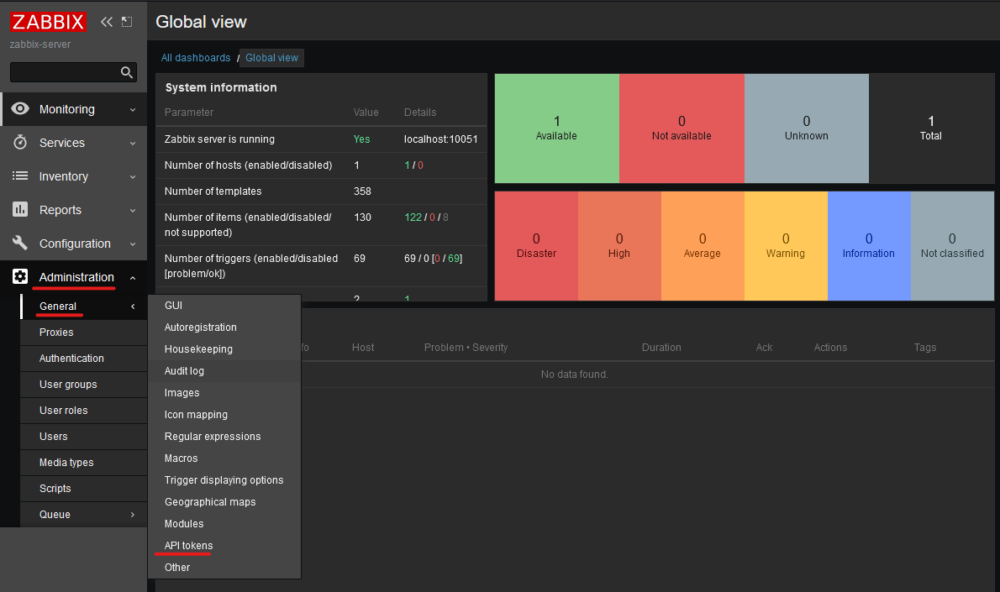
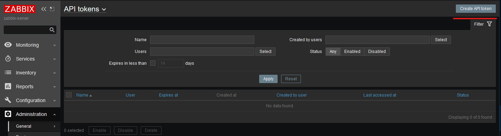
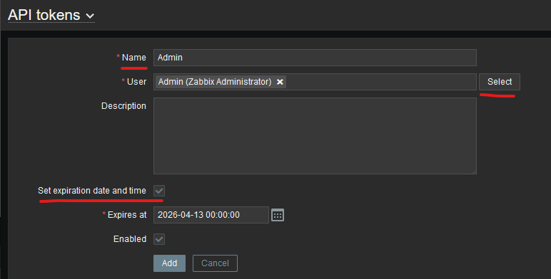
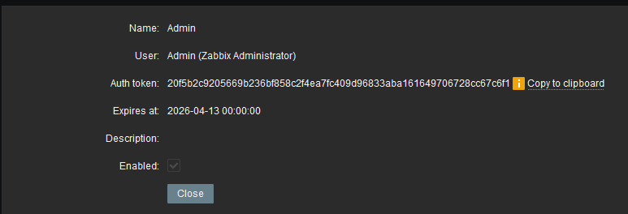
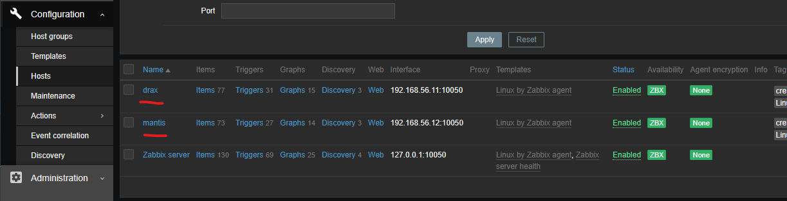

# Criando um ambiente de monitoramento com Zabbix, Vagrant e Ansible
## Introdução

Criei este procedimento com o objetivo de facilitar meus estudos e testes com o Zabbix e Ansible. Utilizei o Debian 12 e o MariaDB para criar o servidor Zabbix, e para os servidores com agentes para testes de monitoramento, utilizei o Rocky Linux 9.3 e o Debian 12.

Gostaria de reforçar que este procedimento foi desenvolvido apenas para fins de estudo; algumas configurações aqui utilizadas não são recomendadas para ambientes produtivos.

Fique à vontade para fazer críticas construtivas e sugerir melhorias :)

## pré-requisitos
#### Softwares:
- [Virtualbox](https://www.virtualbox.org/manual/ch02.html#installation_windows)
- [Vagrant](https://developer.hashicorp.com/vagrant/docs/installation)
- [Putty keygen](https://www.puttygen.com/download-putty)

#### Hardware:
- 4GB RAM livress
- 4 vCPUs

## Iniciando o ambiente

#### Definindo parâmetros de configuração dos servidores:
no arquivo vagrantfile defina as cofigurações para as maquinas virtuais.

É mandatório que o nome do servidor do zabbix seja "zabbix-server" e o sistema operacional seja Debian 12, porque o script install_run_ansible.sh fará uma verificação para rodar o ansible-playbook para a instalação do zabbix server.
```ruby
vms = {
   # defina as configurações do zabbix-server 
  'zabbix-server' => {'memory' => '2048', 'cpus' => 2, 'ip' => '10', 'box' => 'debian/bookworm64'},
  # defina as configurações dos servidores que serão monitorados
  'drax' => {'memory' => '1024', 'cpus' => 1, 'ip' => '11', 'box' => 'generic/rocky9'},
  'mantis' => {'memory' => '1024', 'cpus' => 1, 'ip' => '12', 'box' => 'debian/bookworm64'},
}
```
nos arquivos:
```yaml
 ansible\install_zabbix_server\roles\install_mysql\vars\main.yaml
 ansible\install_zabbix_server\roles\install_zabbix_server\vars\main.yaml 
```


Informe as variáveis para senha da conta de serviço de banco do zabbix e para a conta de admin do banco de dados.


```yaml
ansible\install_zabbix_server\roles\install_mysql\vars\main.yaml

# zabbix
db_zabbix_pass: 
...

#Admin
db_admin_pass: 
```
```yaml
ansible\install_zabbix_server\roles\install_zabbix_server\vars\main.yaml 

...
db_zabbix_pass: 
....
```
no arquivo:
```yaml
 install_run_ansible.sh
```

Informe a chave publica para conexção ssh com putty ou ferramenta de conexão preferida.
- [Veja aqui como criar chave privada com o puttyGen](https://www.ssh.com/academy/ssh/putty/windows/puttygen)

```bash
echo "##########################################"
echo "add private key for connect SSH with putty"
echo "##########################################"
printf "ssh-rsa MdeQhxUul76TD5....." >> /home/vagrant/.ssh/authorized_keys
```
### Subindo o zabbix-server:
Entre na pasta onde está o arquivo vagrantfile e execute o vagrant para inciar a instalação do ambiente
```bash
cd zabbix
vagrant up zabbix-server
```
output:
```bash
    zabbix-server: TASK [install_zabbix_server : start and enable zabbix-agent service] ***********
    zabbix-server: ok: [localhost]
    zabbix-server:
    zabbix-server: TASK [install_zabbix_server : start and enable apache2 service] ****************
    zabbix-server: changed: [localhost]
    zabbix-server:
    zabbix-server: TASK [Print Host IP] ***********************************************************
    zabbix-server: ok: [localhost] => {
    zabbix-server:     "msg": "hostname:zabbix-server ip:['192.168.56.10', '10.0.2.15']"
    zabbix-server: }
    zabbix-server:
    zabbix-server: RUNNING HANDLER [install_zabbix_server : Enable remote login to mysql] *********
    zabbix-server: changed: [localhost]
    zabbix-server:
    zabbix-server: RUNNING HANDLER [install_zabbix_server : Restart mysql] ************************
    zabbix-server: changed: [localhost]
    zabbix-server:
    zabbix-server: PLAY RECAP *********************************************************************
    zabbix-server: localhost                  : ok=27   changed=18   unreachable=0    failed=0    skipped=0 rescued=0    ignored=0
    zabbix-server:

==> zabbix-server: Machine 'zabbix-server' has a post `vagrant up` message. This is a message
==> zabbix-server: from the creator of the Vagrantfile, and not from Vagrant itself:
==> zabbix-server:
==> zabbix-server: Vanilla Debian box. See https://app.vagrantup.com/debian for help and bug reports
```
### Configurando a console do zabbix e criando token para o zabbix api:
No navegador acesse http://192.168.56.10/zabbix/ para fazer a configuração inicial.

Avance as etapas até chegar nas configurações de banco:
informe a senha definada para a conta de serviço do banco do zabbix e avance.



Defina o nome do servidor e fuso horário.



Agora vamos criar um token para a API do Zabbix para que seja o possivel fazer o cadastro de host utilizando o ansible-playbook para instalação de agentes.

O usuario e senha padrão do zabbix é:
Usuário: Admin
Senha: zabbix

Vá até Administration > General > API Tokens



No canto superior direito, clique em Create API Token.



Defina um nome, atribua para o usuario Admin (ou pode ser criado um usário e definir os acesso necessário), e se haverá data de expiração.



Clique em Add e será gerado o token



### Criando dois servidores e cadastrando no monitoramento

No arquivo:
```yaml
ansible/install_zabbix_agent/subscribe_zabbix_agent/vars/main.yaml
```
Informe o valor do token criado.

```yaml
...
token: 20f5b2c9205669b236bf858c2f4ea7fc409d96833aba161649706728cc67c6f1
...
```

Entre na pasta onde está o arquivo vagrantfile e execute o vagrant para inciar a instalação do ambiente.

```bash
cd zabbix
vagrant up
```
output:

```bash
    drax: TASK [subscribe_zabbix_agent : include_tasks] **********************************
    drax: included: /ansible/install_zabbix_agent/subscribe_zabbix_agent/tasks/subscribe_zabbix_agent.yaml for localhost
    drax:
    drax: TASK [subscribe_zabbix_agent : Set API token] **********************************
    drax: ok: [localhost]
    drax:
    drax: TASK [subscribe_zabbix_agent : Create a new host or rewrite an existing hosts info] ***
    drax: changed: [localhost -> 192.168.56.10]
    drax:
    drax: TASK [Print Host IP] ***********************************************************
    drax: ok: [localhost] => {
    drax:     "msg": "hostname:drax ip:['192.168.56.11', '10.0.2.15']"
    drax: }
    drax:
    drax: RUNNING HANDLER [install_zabbix_agent : Restart zabbix-agent2] *****************
    drax: changed: [localhost]
    drax:
    drax: PLAY RECAP *********************************************************************
    drax: localhost                  : ok=17   changed=8    unreachable=0    failed=0    skipped=6    rescued=0    ignored=0
    drax:

......

    mantis: TASK [subscribe_zabbix_agent : include_tasks] **********************************
    mantis: included: /ansible/install_zabbix_agent/subscribe_zabbix_agent/tasks/subscribe_zabbix_agent.yaml for localhost
    mantis:
    mantis: TASK [subscribe_zabbix_agent : Set API token] **********************************
    mantis: ok: [localhost]
    mantis:
    mantis: TASK [subscribe_zabbix_agent : Create a new host or rewrite an existing hosts info] ***
    mantis: changed: [localhost -> 192.168.56.10]
    mantis:
    mantis: TASK [Print Host IP] ***********************************************************
    mantis: ok: [localhost] => {
    mantis:     "msg": "hostname:mantis ip:['192.168.56.12', '10.0.2.15']"
    mantis: }
    mantis:
    mantis: RUNNING HANDLER [install_zabbix_agent : Restart zabbix-agent2] *****************
    mantis: changed: [localhost]
    mantis:
    mantis: PLAY RECAP *********************************************************************
    mantis: localhost                  : ok=17   changed=8    unreachable=0    failed=0    skipped=6    rescued=0    ignored=0
    mantis:

==> zabbix-server: Machine 'zabbix-server' has a post `vagrant up` message. This is a message
==> zabbix-server: from the creator of the Vagrantfile, and not from Vagrant itself:
==> zabbix-server:
==> zabbix-server: Vanilla Debian box. See https://app.vagrantup.com/debian for help and bug reports

==> mantis: Machine 'mantis' has a post `vagrant up` message. This is a message
==> mantis: from the creator of the Vagrantfile, and not from Vagrant itself:
==> mantis:
==> mantis: Vanilla Debian box. See https://app.vagrantup.com/debian for help and bug reports
```

Verá que os servidores foram cadastrados automaticamente no zabbix:


Caso queira destruir o ambiente, execute o vagrant destroy.
```bash
vagrant destory -f 
```

Caso queira apenas baixar o ambiente sem perder os servidores criados, execute o vagrant halt.
```bash
vagrant halt
```

## Conclusão
Neste tutorial, demonstrei como criar um ambiente de monitoramento para testes e estudos de forma automatizada. Em média, a configuração manual desse ambiente levaria aproximadamente de 3 a 4 horas. 

No entanto, utilizando a automação com Vagrant e Ansible, foi possível concluir o processo em média de 30 a 40 minutos.

### Referencias:
- [Como criar chave privada](https://www.ssh.com/academy/ssh/putty/windows/puttygen)
- [Documetação do vagrant](https://developer.hashicorp.com/vagrant/docs)
- [Documetação do ansible](https://docs.ansible.com/)
- [Descomplicando o Ansible](https://www.linuxtips.io/course/descomplicando-o-ansible)
- [Zabbix](https://www.zabbix.com/download?zabbix=6.0&os_distribution=debian&os_version=12&components=server_frontend_agent&db=mysql&ws=apache)